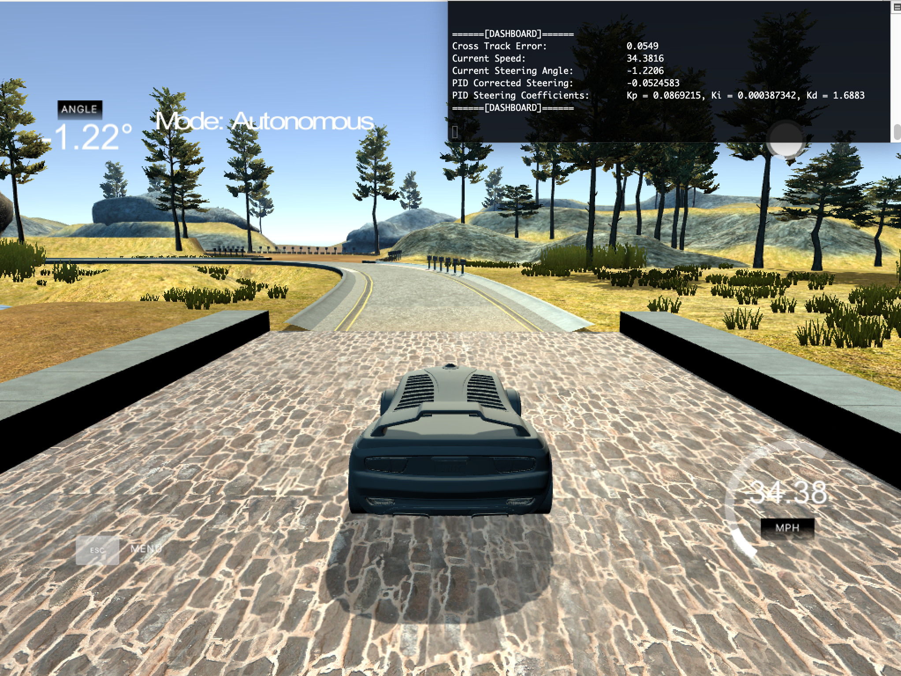

# CarND-Controls-PID-Project
Udacity Self-Driving Car Nanodegree - PID Controller Project



View the project run via my [youtube video!](https://youtu.be/PCT97GeUd7U)

## Overview
The following project explores the controller-based approach to lane driving, as opposed to deep learning as seen in the [CarND-Behavioural-Cloning project.](https://github.com/ahtchow/CarND-BehaviouralCloning-P3) A more classical approach like using a controller can prove to have some benefits, especially if paired with deep learning (two approaches on opposite sides of the spectrum). Simply put, driving in the center of the lane can be much simpler if left in the hands of a feedback controller such as the proportional–integral–derivative controller. The objective of the controller is to tune the steering angle, through continuously adjusting hyperparameters based on error. Let's see how I did it!

## Goal of the Project
* Implement a PID controller that measures error.
* Implement an algorithm that adjusted hyperparameter dynamically.
* Drive the autonomous car on the simulator simply using the PID controller.

## Components of the PID Controller

### "P" - Proportional
The proportional aspect of the controller measures the magnitude of adjustment required in proportion to the "Cross Track" Error (CTE). The CTE measures the distance from the center of the lane, thus the further away the vehicle is from the lane the higher the CTE. The proportional aspect of the controller can be modeled by the following equation:

```bash
α = - τ_p * CTE
```
  *  α -> Steering Angle
  *  τ_p -> Proportion Controller Constant
  *  CTE -> Cross Track Error

### "I" - Integral
The Integral aspect of the controller sums up all the "Cross Track" Error (CTE) to account for any biased to error. Suppose the wheels on your car has wheels that were out of alignment, as the car continued to drive a substantial amount of error would accumulate. To address any system bias, the integral controller will act as a dynamic offset to oppose the bias accumulated overtime. The integral aspect of the controller can be modeled by the following equation:

```bash
α = - τ_i * (Σ CTE)
```
  *  α -> Steering Angle
  *  τ_i -> Integral Controller Constant
  *  Σ CTE -> Summation of Cross Track Error

### "D" - Derivative
The Derivative aspect of the controller measures the rate of change "Cross Track" Error (CTE) over time. As a result, as the rate of change increases so will need to steer away from the current state. An example can be when the lane is curving, such that there is a sudden change of error. The derivative controller accounts for the system's shift in state. The derivative aspect of the controller can be modeled by the following equation:

```bash
α = - τ_d * (d/dt) * CTE
# (d/dt) * CTE = CTE_t - CTE_(t-1) / ΔT to simplify
```
  *  α -> Steering Angle
  *  τ_d -> Derivative Controller Constant
  *  (d/dt) * CTE -> Change in Cross Track Error Overtime

### Twiddle Algorithm - Hyperparameter Tuning [τ_p, τ_i, τ_d]
A common algorithm refered to the ["TWIDDLE" ALGORITHIM](https://martin-thoma.com/twiddle/) was implemented to search for the best hyperparameters in [τ_p, τ_i, τ_d]. Here is pythonic pseudo code:

```bash
# Choose an initialization parameter vector
p = [0, 0, 0]
# Define potential changes
dp = [1, 1, 1]
# Calculate the error
best_err = A(p)

threshold = 0.001

while sum(dp) > threshold:
    for i in range(len(p)):
        p[i] += dp[i]
        err = A(p)

        if err < best_err:  # There was some improvement
            best_err = err
            dp[i] *= 1.1
        else:  # There was no improvement
            p[i] -= 2 * dp[i]  # Go into the other direction
            err = A(p)

            if err < best_err:  # There was an improvement
                best_err = err
                dp[i] *= 1.05
            else:  # There was no improvement
                p[i] += dp[i]
                # As there was no improvement, the step size in either
                # direction, the step size might simply be too big.
                dp[i] *= 0.95
```

Though the basis of the algorithm was identical, the tuning was done in small increments (i.e 7 STEPS/ITERATION) due to the speed of updating. I did not want to have the system rapidly change the steering angle for no reason, but instead respond to the sharp corners within the map. Here are the initial values I selected for this project:

```bash
#C++ Implementation

static constexpr double tau_p = 0.15; #P constant
static constexpr double tau_i = 0.0004; #I constant
static constexpr double tau_d = 5.0; #D constant
static constexpr double THROTTLE = 0.3; # Constant Throttling
static const vector<double> INCREMENT = {0.000001, 0.000000001, 0.00001}; # Dp variables for twiddle algorithm
static const int MAX_STEPS = 7;
```

Overall, the basis of the constants was sufficient to drive the car w/o the Twiddle Algorithm. On the flip side, when the twiddle algorithm was used the corners were handles much more smoothly.

### Basic Build Instructions

First, download the latest [Term 2 Simulator.](https://github.com/udacity/self-driving-car-sim/releases)

[Note] You may have to set the simulator to an executable file using:

```bash
chmod +x filename
```

1. Clone this repo.
2. Make a build directory: `mkdir build && cd build`
3. Compile: `cmake .. && make`
4. Run it: `./pid`.  

---
## Everything Else

### Dependencies

* cmake >= 3.5
 * All OSes: [click here for installation instructions](https://cmake.org/install/)
* make >= 4.1(mac, linux), 3.81(Windows)
  * Linux: make is installed by default on most Linux distros
  * Mac: [install Xcode command line tools to get make](https://developer.apple.com/xcode/features/)
  * Windows: [Click here for installation instructions](http://gnuwin32.sourceforge.net/packages/make.htm)
* gcc/g++ >= 5.4
  * Linux: gcc / g++ is installed by default on most Linux distros
  * Mac: same deal as make - [install Xcode command line tools]((https://developer.apple.com/xcode/features/)
  * Windows: recommend using [MinGW](http://www.mingw.org/)
* [uWebSockets](https://github.com/uWebSockets/uWebSockets)
  * Run either `./install-mac.sh` or `./install-ubuntu.sh`.
  * If you install from source, checkout to commit `e94b6e1`, i.e.
    ```
    git clone https://github.com/uWebSockets/uWebSockets
    cd uWebSockets
    git checkout e94b6e1
    ```
    Some function signatures have changed in v0.14.x. See [this PR](https://github.com/udacity/CarND-MPC-Project/pull/3) for more details.
* Simulator. You can download these from the [project intro page](https://github.com/udacity/self-driving-car-sim/releases) in the classroom.

Fellow students have put together a guide to Windows set-up for the project [here](https://s3-us-west-1.amazonaws.com/udacity-selfdrivingcar/files/Kidnapped_Vehicle_Windows_Setup.pdf) if the environment you have set up for the Sensor Fusion projects does not work for this project. There's also an experimental patch for windows in this [PR](https://github.com/udacity/CarND-PID-Control-Project/pull/3).

Tips for setting up your environment can be found [here](https://classroom.udacity.com/nanodegrees/nd013/parts/40f38239-66b6-46ec-ae68-03afd8a601c8/modules/0949fca6-b379-42af-a919-ee50aa304e6a/lessons/f758c44c-5e40-4e01-93b5-1a82aa4e044f/concepts/23d376c7-0195-4276-bdf0-e02f1f3c665d)

### Editor Settings

We've purposefully kept editor configuration files out of this repo in order to
keep it as simple and environment agnostic as possible. However, we recommend
using the following settings:

* indent using spaces
* set tab width to 2 spaces (keeps the matrices in source code aligned)

### Code Style

Please (do your best to) stick to [Google's C++ style guide](https://google.github.io/styleguide/cppguide.html).

### Project Instructions and Rubric

Note: regardless of the changes you make, your project must be buildable using
cmake and make!

More information is only accessible by people who are already enrolled in Term 2
of CarND. If you are enrolled, see [the project page](https://classroom.udacity.com/nanodegrees/nd013/parts/40f38239-66b6-46ec-ae68-03afd8a601c8/modules/f1820894-8322-4bb3-81aa-b26b3c6dcbaf/lessons/e8235395-22dd-4b87-88e0-d108c5e5bbf4/concepts/6a4d8d42-6a04-4aa6-b284-1697c0fd6562)
for instructions and the project rubric.

### Call for IDE Profiles Pull Requests

Help your fellow students!

We decided to create Makefiles with cmake to keep this project as platform
agnostic as possible. Similarly, we omitted IDE profiles in order to we ensure
that students don'the feel pressured to use one IDE or another.

However! I'd love to help people get up and running with their IDEs of choice.
If you've created a profile for an IDE that you think other students would
appreciate, we'd love to have you add the requisite profile files and
instructions to ide_profiles/. For example if you wanted to add a VS Code
profile, you'd add:

* /ide_profiles/vscode/.vscode
* /ide_profiles/vscode/README.md

The README should explain what the profile does, how to take advantage of it,
and how to install it.

Frankly, I've never been involved in a project with multiple IDE profiles
before. I believe the best way to handle this would be to keep them out of the
repo root to avoid clutter. My expectation is that most profiles will include
instructions to copy files to a new location to get picked up by the IDE, but
that's just a guess.

One last note here: regardless of the IDE used, every submitted project must
still be compilable with cmake and make./
